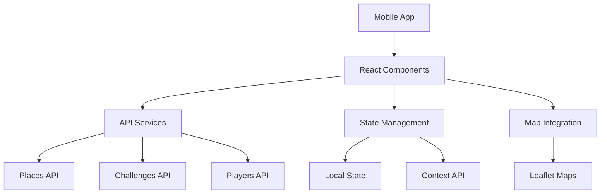

# Design Document

## Overview

The Foosball Challenge App is a React-based mobile web application that enables players to discover foosball locations, create and join challenges, and manage their player profiles. The app leverages the existing React + TypeScript + Material-UI + Leaflet stack to provide a responsive mobile experience with map integration.

## Architecture

### High-Level Architecture



### Technology Stack

- **Frontend Framework**: React 19 with TypeScript
- **UI Library**: Material-UI (MUI) v7
- **Map Integration**: React-Leaflet with Leaflet
- **Build Tool**: Vite
- **State Management**: React Context API + useState/useReducer
- **HTTP Client**: Fetch API
- **Styling**: Material-UI theming + CSS modules

## Components and Interfaces

### Core Components

#### 1. App Component (Root)
- **Purpose**: Main application wrapper with routing and global state
- **Responsibilities**: 
  - Initialize global context providers
  - Handle app-level state management
  - Provide routing between main sections

#### 2. MobileLayout Component
- **Purpose**: Consistent mobile layout with header and footer navigation
- **Props**: 
  ```typescript
  interface MobileLayoutProps {
    children: React.ReactNode;
    currentSection: 'home' | 'places' | 'challenges' | 'profile';
  }
  ```
- **Features**:
  - Fixed header with "Play foosball" title
  - Bottom navigation with Home, Places, Challenges, Profile
  - Responsive content area

#### 3. MapView Component (Enhanced)
- **Purpose**: Interactive map displaying foosball places
- **Props**:
  ```typescript
  interface MapViewProps {
    places: Place[];
    onPlaceSelect: (place: Place) => void;
    selectedPlace?: Place;
  }
  ```
- **Features**:
  - Leaflet map with place markers
  - Place selection and detail popup
  - Challenge creation trigger

#### 4. PlacesList Component
- **Purpose**: List view of all available places
- **Props**:
  ```typescript
  interface PlacesListProps {
    places: Place[];
    onPlaceSelect: (place: Place) => void;
  }
  ```

#### 5. ChallengesList Component
- **Purpose**: Display and manage challenges
- **Props**:
  ```typescript
  interface ChallengesListProps {
    challenges: Challenge[];
    onJoinChallenge: (challengeId: string) => void;
    onCreateChallenge: () => void;
  }
  ```

#### 6. ChallengeForm Component
- **Purpose**: Create new challenges
- **Props**:
  ```typescript
  interface ChallengeFormProps {
    place: Place;
    onSubmit: (challenge: CreateChallengeRequest) => void;
    onCancel: () => void;
  }
  ```

#### 7. PlayerProfile Component
- **Purpose**: Display and edit player information
- **Props**:
  ```typescript
  interface PlayerProfileProps {
    player: Player;
    onUpdateProfile: (updates: Partial<Player>) => void;
  }
  ```

### API Service Layer

#### PlacesService
```typescript
class PlacesService {
  static async getPlaces(): Promise<Place[]>
  static async getPlaceById(id: string): Promise<Place>
}
```

#### ChallengesService
```typescript
class ChallengesService {
  static async getChallenges(): Promise<Challenge[]>
  static async createChallenge(challenge: CreateChallengeRequest): Promise<Challenge>
  static async joinChallenge(challengeId: string, playerId: string): Promise<void>
  static async getChallengesByPlace(placeId: string): Promise<Challenge[]>
}
```

#### PlayersService
```typescript
class PlayersService {
  static async getCurrentPlayer(): Promise<Player>
  static async updatePlayer(updates: Partial<Player>): Promise<Player>
}
```

## Data Models

### Place Model
```typescript
interface Place {
  id: string;
  name: string;
  coordinates: {
    lat: number;
    long: number;
  };
  status: string; // "1" for active
}
```

### Challenge Model
```typescript
interface Challenge {
  id: string;
  name: string;
  place: Place;
  date: string; // ISO date string
  time: string; // "Morning" | "Afternoon" | "Evening"
  status: "Open" | "Closed" | "Completed";
  owner: Player;
  players: Player[];
}

interface CreateChallengeRequest {
  name: string;
  placeId: string;
  date: string;
  time: string;
}
```

### Player Model
```typescript
interface Player {
  id: string;
  name: string;
  expertise: "Beginner" | "Intermediate" | "Expert";
  points: number;
}
```

## State Management

### Global Context Structure

#### AppContext
```typescript
interface AppContextType {
  currentPlayer: Player | null;
  places: Place[];
  challenges: Challenge[];
  loading: boolean;
  error: string | null;
}
```

#### Actions
```typescript
type AppAction = 
  | { type: 'SET_PLACES'; payload: Place[] }
  | { type: 'SET_CHALLENGES'; payload: Challenge[] }
  | { type: 'SET_CURRENT_PLAYER'; payload: Player }
  | { type: 'ADD_CHALLENGE'; payload: Challenge }
  | { type: 'JOIN_CHALLENGE'; payload: { challengeId: string; player: Player } }
  | { type: 'SET_LOADING'; payload: boolean }
  | { type: 'SET_ERROR'; payload: string | null };
```

### Local Component State
- Form states for challenge creation
- UI states (selected place, modal visibility)
- Map interaction states (zoom, center)

## Navigation and Routing

### Section-Based Navigation
The app uses a single-page approach with section switching:

1. **Home Section**: Map view with places and quick actions
2. **Places Section**: List view of all places with details
3. **Challenges Section**: Challenge management and participation
4. **Profile Section**: Player profile management

### Navigation State
```typescript
type AppSection = 'home' | 'places' | 'challenges' | 'profile';

interface NavigationState {
  currentSection: AppSection;
  previousSection?: AppSection;
}
```

## Error Handling

### API Error Handling
- Network errors: Display retry mechanism
- Server errors: Show user-friendly error messages
- Validation errors: Highlight form fields with specific messages

### Error Boundary
- Implement React Error Boundary for component-level error catching
- Graceful fallback UI for critical failures

### Error States
```typescript
interface ErrorState {
  type: 'network' | 'validation' | 'server' | 'unknown';
  message: string;
  retryable: boolean;
}
```

## Mobile Optimization

### Responsive Design
- Mobile-first approach using Material-UI breakpoints
- Touch-friendly button sizes (minimum 44px)
- Optimized map interactions for touch devices

### Performance Considerations
- Lazy loading of map tiles
- Efficient re-rendering with React.memo
- Debounced API calls for search functionality

### Offline Considerations
- Cache recently viewed places and challenges
- Show offline indicators when network is unavailable
- Queue challenge creation/joining for when online

## Testing Strategy

### Unit Testing
- Component rendering tests with React Testing Library
- Service layer tests with mocked API responses
- Utility function tests for data transformations

### Integration Testing
- API service integration tests
- Component interaction tests
- State management flow tests

### End-to-End Testing
- User journey tests for core workflows:
  - Viewing places on map
  - Creating a challenge
  - Joining a challenge
  - Profile management

### Test Structure
```
src/
  __tests__/
    components/
    services/
    utils/
  components/
    __tests__/
```

## Security Considerations

### API Security
- Validate all API responses
- Sanitize user inputs
- Handle authentication tokens securely

### Data Validation
- Client-side validation for all forms
- Type checking with TypeScript
- Input sanitization for XSS prevention

## Performance Optimization

### Code Splitting
- Lazy load sections using React.lazy()
- Dynamic imports for heavy components

### Caching Strategy
- Cache API responses with appropriate TTL
- Memoize expensive calculations
- Optimize map rendering performance

### Bundle Optimization
- Tree shaking for unused Material-UI components
- Optimize Leaflet bundle size
- Compress images and assets